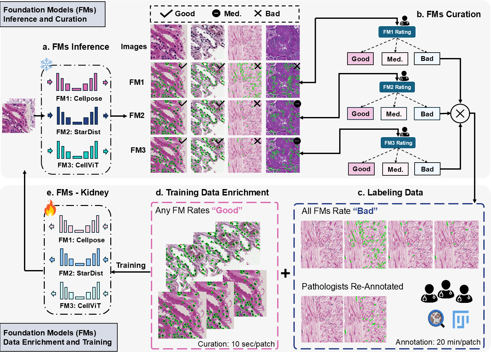

# AFM_kidney_cells
AI foundation models for kidney pathology cells. The official implementation of the following papers. 

**Foundation Models Inference and Curation**
> **Stage 1 paper**: [**Assessment of Cell Nuclei AI Foundation Models in Kidney Pathology**](https://www.arxiv.org/abs/2408.06381),                 
> Junlin Guo, Siqi Lu, Can Cui, Ruining Deng, Tianyuan Yao, Zhewen Tao, Yizhe Lin, Marilyn Lionts, Quan Liu, Juming Xiong, Yu Wang, Shilin Zhao, Catie Chang, Mitchell Wilkes, Mengmeng Yin, Haichun Yang, Yuankai Huo                     
> *arXiv ([arXiv:2408.06381](https://www.arxiv.org/abs/2408.06381))*

**Foundation Models Data Enrichment and Training**
> **Stage 2 paper**: [**How Good Are We? Evaluating Cell AI Foundation Models in Kidney Pathology with Human-in-the-Loop Enrichment**](https://arxiv.org/abs/2411.00078),          
> Junlin Guo, Siqi Lu, Can Cui, Ruining Deng, Tianyuan Yao, Zhewen Tao, Yizhe Lin, Marilyn Lionts, Quan Liu, Juming Xiong, Yu Wang, Shilin Zhao, Catie Chang, Mitchell Wilkes, Mengmeng Yin, Haichun Yang, Yuankai Huo                           
> *arXiv ([arXiv:2411.00078](https://arxiv.org/abs/2411.00078))* | under review by Nature Communications Medicine

## Purpose
- **Arise of Foundation Models:** 
Foundation models have gained prominence as a common solution in digital pathology. However, despite advances in target task complexity, the research community still lacks a concrete evaluation of the effectiveness of foundation models. 

- **Performance Assessment (Stage 1 paper):** 
It remains unclear whether the generalizability of these models is sufficient to handle the diversity present in simpler, yet essential, tasks such as single-organ nuclei segmentation. Thus, we perform a large-scale evaluation of three widely used state-of-the-art (SOTA) cell nuclei foundation models—Cellpose, StarDist, and CellViT. 

- **Data Enrichment Continual Learning (Stage 2 paper)**: Additionally, we tackle a more challenging question, “How can we improve?”, by developing efficient human-in-the-loop data enrichment strategies aimed at contiously enhancing foundation model performance while minimizing the reliance on human annotation. Our designed approaches resolve this limitaiton by ensembling the performance evaluation outcomes from Stage 1. 

## Highlights 
- **Simple:** We provided simplified, GPU-optimized inference pipelines, implemented as easy-to-use Python classes. (Stage 1: Using model's H&E cell nuclei pretrained weights, Stage 2: Using our fine-tuned kidney cell foundation models)

- **Data Enrichment:** A novel data enrichment strategy is proposed, utilizing the different foundation models' prediction outcomes (from Stage 1) to jointly improve performance with minimal human labeling effort (Stage 2)

- **Improved Model and QuPath Plugins:** We provide a benchmark for the development of three cell foundaiton models. The improved model weights can be relased and for easy inference. The best improved model (StarDist) can be directly 
used in QuPath Software. 

## Installation    
- Stage 1 paper 
  - Cellpose model GPU Inference 
  - StarDist model GPU Inference 
  - CellViT model GPU
- Stage 2 paper
  - Cellpose-Kidney 
  - StarDist-Kidney
  - CellViT-Kidney

