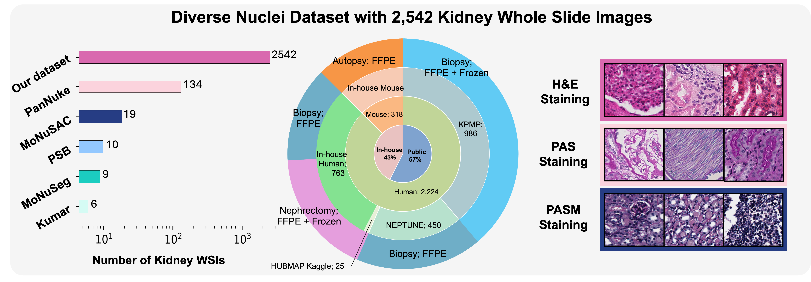
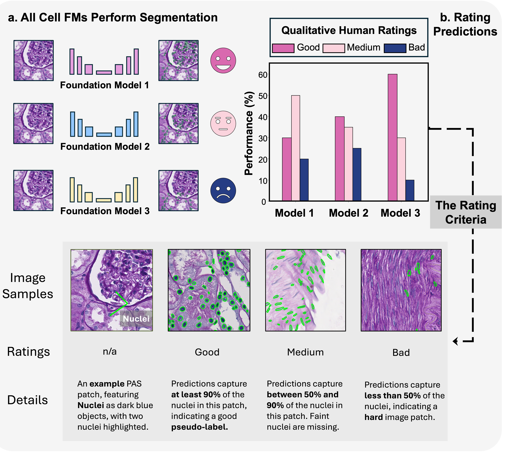
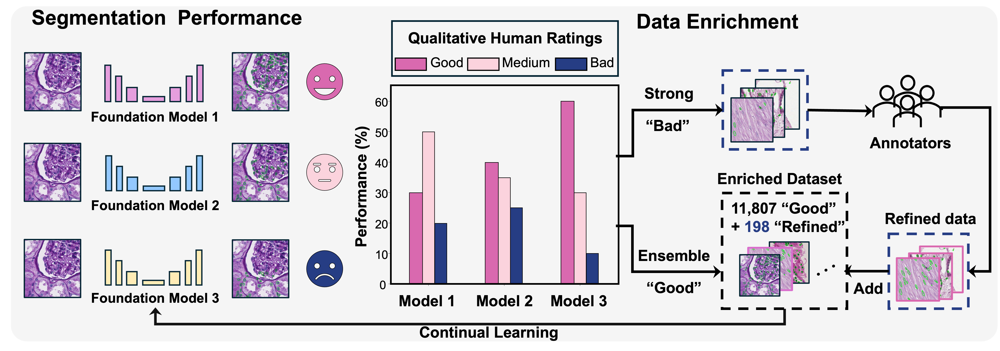
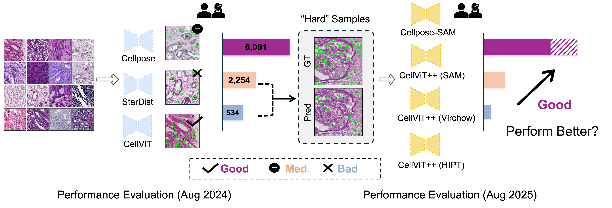
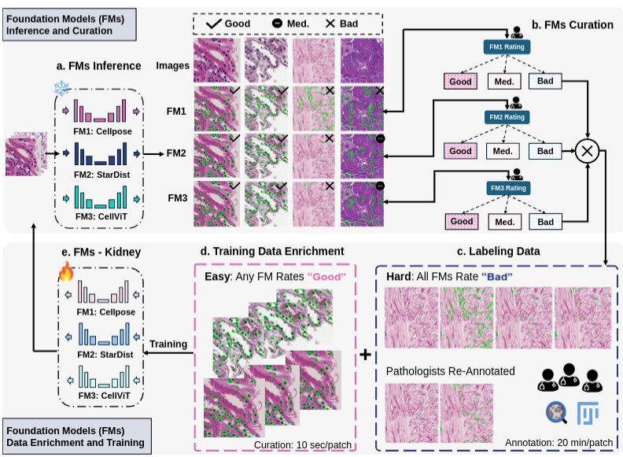
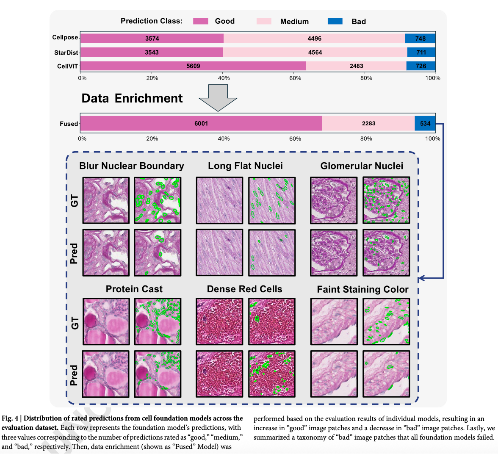
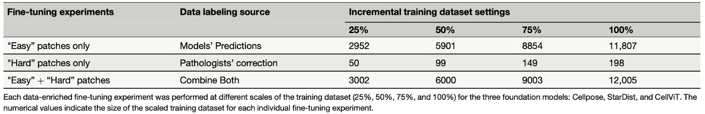
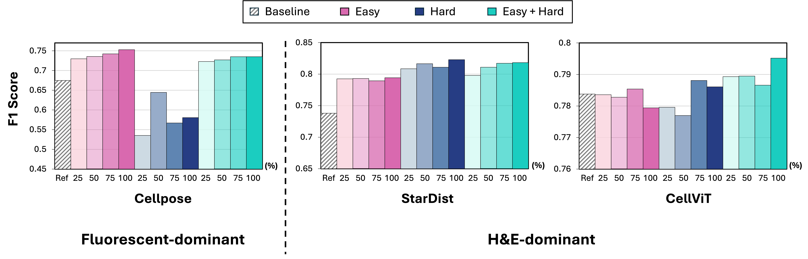
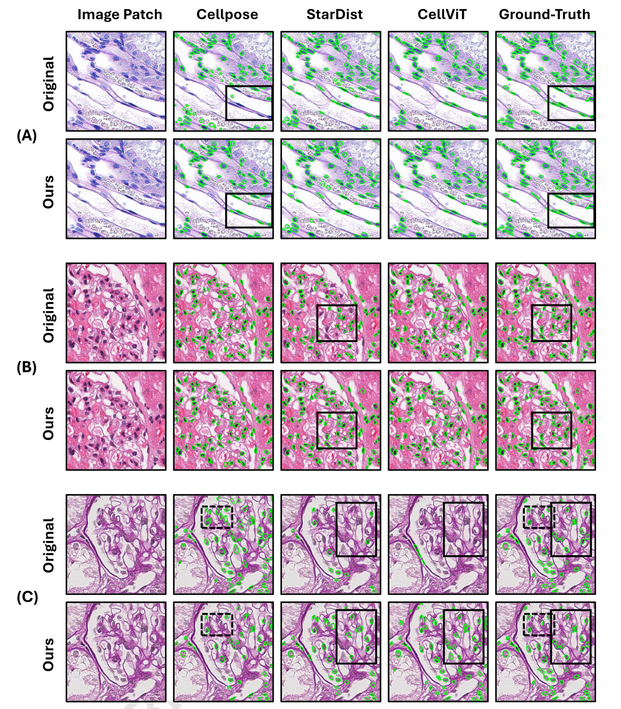
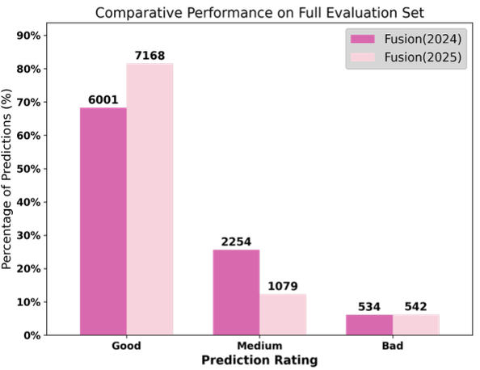

# CellFM-HITL: A Multi-Foundation-Model–Based Human-in-the-Loop Framework for Model Evaluation and Efficient Data Enrichment in Nuclei Segmentation

>**TL;DR**: A human-in-the-loop (HITL) workflow that uses multiple **cell AI foundation models (FMs)** to **assess** nucleus segmentation quality. CellFM-HITL **scalably enriches nuclei annotations** by combining **FMs-generated-pedictions with minimal expert annotation** to **enhance FM performance** in targeted domain (e.g., in Kidney pathology) and streamline pathology workflows.

<p align="center">
  <a href='https://arxiv.org/abs/2408.06381'></a> 
  <a href='https://www.nature.com/articles/s43856-025-01205-x'></a> 
  <a href='https://arxiv.org/abs/2510.01287'></a> 
</p>

<p align="center">
  <a href="#-highlights">Highlights</a> •
  <a href="#-cellfm-hitl-workflow-overview">Workflow</a> •
  <a href="#-cell-fms-inference-pipeline--model-summary">Model Summary</a> •
  <a href="#%EF%B8%8F-cellfms-hitl-data-enrichment-illustration">Data Enrichment</a> •
  <a href="#-continuous-model-fine-tuning-with-enriched-data">Fine-Tuning</a> •
  <a href="#results">Results</a> •
  <a href="#citation">Citation</a> •
  <a href="#-contact--contribution">Contact</a> •
  <a href="#awesome-histopathological-nuclei-segmentation-models">Awesome List</a>
</p>

This **ongoing project** welcomes researchers to **share** their work with the **cell segmentation community** by submitting pull requests or issues to add or update paper information here: [**Awesome Histopathological Nuclei Segmentation Models**](#awesome-histopathological-nuclei-segmentation-models).

## 🔥 Last Updated: 2025.11.27
- **[2025.11.27]** Stage 2 fine-tuned **model weights** and instructions: **Cellpose, StarDist**

  → [stage2_paper](stage2_paper) directory: [model_weights](./stage2_paper/model_weights/) (select best from strategies), [QuPath StarDist model_weights](./stage2_paper/model_weights/stardist-qupath/) (.pb files)

  → [QuPath StarDist Plugin](./qupath_stardist/): How to installed and use our pretrained models in QuPath.

  → [google drive](https://drive.google.com/drive/folders/1ztkcIC63Kjwafq6tHuEnENSdZ8-H3gSz?usp=sharing) (all weights) 

- **[2025.11.16]** Stage 3 baseline models Inference (**CellViT++, Cellpose-SAM**):  
  → [stage3_paper](stage3_paper) directory: Cellpose-SAM (done)
- **[2025.11.05]** Stage 1, 2 baseline models Inference (**CellViT, StarDist, Cellpose**) are available in:  
  → [Model Summary Table](#-cell-fms-inference-pipeline--model-summary)  
  → [stage1_paper](stage1_paper) directory


- **[Use in QuPath]** Masks/Predictions converted to Geojson (Qupath): [mask_to_geojson_qupath.py](./mask_to_geojson_qupath.py)

- **[In Progress]** Annotated dataset curation for the **2nd KPI Challenge**.

### 📢 Publication Updates

- **[2025.10.30] — Stage 3 (Medical Imaging 2026)**  
  [*Evaluating New AI Cell Foundation Models on Challenging Kidney Pathology Cases Unaddressed by Previous Foundation Models*](https://arxiv.org/abs/2510.01287)  
  **Keywords:** Next-gen CellFM-HITL with newer Cell FMs (2025); challenging-case evaluation.

- **[2025.10.14] — Stage 2 (Nat. Commun. Med. 2025)**  
  [*Evaluating Cell AI Foundation Models in Kidney Pathology with Human-in-the-Loop Enrichment*](https://www.nature.com/articles/s43856-025-01205-x)  
  **Keywords:** CellFM-HITL framework for assessment + efficient refinement; Cell FMs (2024).

- **[2024.10.27] — Stage 1 (Medical Imaging 2025)**  
  [*Assessment of Cell Nuclei AI Foundation Models in Kidney Pathology*](https://arxiv.org/abs/2408.06381)  
  **Keywords:** First large-scale Cell FM evaluation in kidney; Cell FMs (2024).


## 🎯 Highlights

- **Perform SOTA Cell AI FMs Assessment:**  Ready-to-use patch-level instance segmentation inference pipelines.

- **Multi-FMs-based HITL Data Enrichment Framework:**  Scalably enriches high-quality labeled nuclei image patches with cell FMs, boosting performance while reducing expert annotation effort.

- **Cell AI FMs Fine-tuning Support:**  Patch-level fine-tuning codebases for continous model enhancement.
  
## 🚀 CellFM-HITL Workflow Overview

- Step 1: **Individual Current SOTA Cell FMs Performance** ([Cell FMs Inference Pipeline & Model Summary](#-cell-fms-inference-pipeline--model-summary)) (Stages 1, 2, 3 Papers)

- Step 2: **Multi-FMs Performance Rating and Data Enrichment** ([CellFMs-HITL Data Enrichment Illustration](#%EF%B8%8F-cellfms-hitl-data-enrichment-illustration)) (Stage 2 Paper)

- Step 3: **Cell FMs Continuous Fine-Tuning with Scalably Enriched Data** ([Continuous Model Fine-Tuning with Enriched Data](#-continuous-model-fine-tuning-with-enriched-data)) (Stage 2 Paper)


## 🔬 Cell FMs Inference Pipeline & Model Summary

The tables summarize the evaluated SOTA cell FMs, their code sources, and our custom patch-level inference Python pipelines from our Stages 1, 2, 3 papers' model assessments.

### Cell FMs Released Before 2024 Aug.

| Year–Month | Model                 | Backbone        | Post-processing       | Original Repo                                 | Model Paper                                                                                  | Custom Patch-Level Pipeline                         | Our Work                                                                                                               |
|-------------|----------------------|-----------------|-----------------------|-----------------------------------------------|-----------------------------------------------------------------------------------------------|----------------------------------------------|------------------------------------------------------------------------------------------------------------------------|
| 2022 Mar   | **StarDist (Histo.)** | U-Net           | Star-convex Polygon   | [Link](https://github.com/stardist/stardist)  | [ISBI 2022](https://arxiv.org/abs/2203.02284)                                                | [StarDist Inference](stage1_paper/stardist-inference-gpu); [QuPath Plugin](./qupath_stardist/README.md)| [Medical Imaging 2025](https://arxiv.org/abs/2408.06381) (Stage 1); <br>[Nat. Commun. Med. 2025](https://www.nature.com/articles/s43856-025-01205-x) (Stage 2)|
| 2022 Nov   | **Cellpose**          | U-Net           | GradientFlow Tracking | [Link](https://github.com/MouseLand/cellpose) | [Nat. Methods 2021](https://www.nature.com/articles/s41592-020-01018-x)                      | [Cellpose Inference](stage1_paper/cellpose-inference-gpu)                      | (same as above)                                                                                                       |
| 2023 Oct   | **CellViT**           | ViT (HIPT, SAM) | HoVer-Net             | [Link](https://github.com/TIO-IKIM/CellViT)   | [Med. Image Anal. 2023](https://www.sciencedirect.com/science/article/pii/S1361841524000689) | [CellViT Inference](stage1_paper/cellvit-inference-gpu)                       | (same as above)                                                                                                       |


### Cell FMs Released 2024 Aug. – 2025 Aug.

| Year–Month | Model | Backbone | Post-processing | Original Repo | Model Paper | Custom Patch-Level Inference | Our Work |
|-------------|--------|----------------------|-----------------|----------------|--------------|----------------------------------|------------------|
| 2025 Jan | **CellViT++** | ViT (HIPT, SAM, Virchow, UNI) | HoVer-Net | [Link](https://github.com/TIO-IKIM/CellViT-Plus-Plus) | [arXiv](https://arxiv.org/abs/2501.05269) | [CellViT++ Patch Inference (updating)](stage3_paper/cellvit-plusplus-inference-gpu) | [Medical Imaging 2026](https://arxiv.org/abs/2510.01287) (Stage 3)|
| 2025 May | **Cellpose-SAM (Cellpose 4.0)** | SAM | GradientFlow Tracking | [Link](https://github.com/MouseLand/cellpose) | [bioRxiv](https://www.biorxiv.org/content/10.1101/2025.04.28.651001v1) | [Cellpose-SAM Inference](stage3_paper/cellpose-sam-inference-gpu) | [Medical Imaging 2026](https://arxiv.org/abs/2510.01287) (Stage 3)|

<br>

🔥 **Notes**:
- For easier Human-in-the-loop **correction on the model predictions** (next stage), the code converting **prediction mask to geojson (Qupath)** are provided [**mask_to_geojson_qupath.py**](mask_to_geojson_qupath.py).


## ⚙️ CellFMs-HITL Data Enrichment Illustration

**Motivation**: There is still limited understanding of AI/DL models’ performance in nuclei segmentation on complex organs (e.g., kidney). **How good are we? How can we improve it scalably?** 

1. Large-scale, Diverse dataset for Evaluation 

<p align="center">
  
</p>


2. Less model bias and more generalizability — leveraging multiple cell FMs!

<p align="center">
  
</p>


3. How can we efficiently improve them ? Our CellFM-HITL Data Enrichment.

<p align="center">
  
</p>

4. This HITL framework can be iterative. See advances of CellFMs in our Stage 3 paper.
<p align="center">
  
</p>


## 🔁 Continuous Model Fine-Tuning with Enriched Data

<!-- <p align="center">
  
</p> -->


- **Finetuning**: Stage 2 focuses on validating the CellFM-HITL framework and uses Cell FMs released before August 2024. Detail see [stage2_paper folder](./stage2_paper/README.md) on how to do the inference and training.


  Finetuned Models | data processing| Best Weights from Strategies| Implementations|
  |:---:|:---:|:---:|:---:|
  | StarDist (Histo.) |  RGB |[Easy, Hard, Combined](./stage2_paper/model_weights/stardist/) | [stardist_tuned](./stage2_paper/stardist_tuned/README.md)|
  |Cellpose Finetuned| DAPI-like | [Easy](./stage2_paper/model_weights/cellpose/Easy_100%/) | [cellpose_tuned](./stage2_paper/cellpose_tuned/README.md)
  | CellViT   |  RGB | | |

- **Google Drive**:Due to storage limits, the **best model weights** are listed above and saved in [model_weights](./stage2_paper/model_weights/); all model weights are available on this [Google Drive Link](https://drive.google.com/drive/folders/1ztkcIC63Kjwafq6tHuEnENSdZ8-H3gSz?usp=sharing).


- **Newer models**: Since Stage 2 was submitted in Nov 2024, benchmarking of Cellpose-SAM and CellViT++ is placed in the [stage3_paper folder](./stage3_paper/) to assess the unaddressed or challenging Stage 2 samples.

## Results 

<p align="left">
  <a href='https://www.nature.com/articles/s43856-025-01205-x'></a> 
</p>


### Model Performances 

- Individual model predictions (**Cellpose, StarDist, CellViT**) are rated.

- **Shared failure cases** across all models highlight **domain gaps in kidney pathology** and important for targeted fine-tuning.

- Fusing the **"Good"** predictions from multiple FMs **enriches the labeled dataset** with less single-model bias and better generalization.

<p align="center">
  
</p>

### Data Enrichement Strategies

<br>



### CellFM-HTML Performance Validation

- Baselines: We evaluated each foundation model’s (Cellpose, StarDist, CellViT) pre-trained weights on our hold-out test set.

- F1-score comparisons across training/annotation strategies are shown (below). Full metrics (F1, Precision, Recall) are provided in the [Table](assets/f1-recall-prec.png).

<br>

<p align="center">
  
</p>


- Qualitative results. Areas of improvement highlighted by rectangles.

<p align="center">
  
</p>

#### Take-away from our CellFM-HITL Asessment and Annotation Enrichment
- **Baseline performance evaluation**, CellViT achieves the highest F1 score of 0.78. Kidney-targeted FMs still required.
- **Fine-tuning with enriched data** improves all three models, with StarDist achieving the highest F1 score of 0.82. 
- **Annotation Enrichment**: We found the **combination** of the <ins>foundation model–generated pseudo-labels</ins> and <ins>a subset of pathologist-corrected hard patches</ins> yields consistent performance gains across all models.

 ### This CellFM-HITL Assessment and Enhancement Framework can be Iterative.

<p align="left">
  <a href='https://arxiv.org/abs/2510.01287'></a> 
</p>


- With newer Cell AI FMs (2025) such as CellViT++[Virchow] and Cellpose-SAM, a portion of the **previously rated “medium” or challenging patches** are now correctly labeled by these newer models (rated as “Good”). E.g., [CellFMs-HITL Data Enrichment Illustration#4](#%EF%B8%8F-cellfms-hitl-data-enrichment-illustration).

- This framework **scalably acquiring and curating** labeled nuclei datasets in kidney histopathology

<br>

<p align="center">
  
</p>

## Citation

If you find this repository useful, please consider giving a ⭐ and citing our papers:

```bibtex
@inproceedings{guo2025assessment,
  title={Assessment of cell nuclei AI foundation models in kidney pathology},
  author={Guo, Junlin and Lu, Siqi and Cui, Can and Deng, Ruining and Yao, Tianyuan and Tao, Zhewen and Lin, Yizhe and Lionts, Marilyn and Liu, Quan and Xiong, Juming and others},
  booktitle={Medical Imaging 2025: Image Perception, Observer Performance, and Technology Assessment},
  volume={13409},
  pages={76--82},
  year={2025},
  organization={SPIE}
}


@article{guo2025evaluating,
  title={Evaluating cell AI foundation models in kidney pathology with human-in-the-loop enrichment},
  author={Guo, Junlin and Lu, Siqi and Cui, Can and Deng, Ruining and Yao, Tianyuan and Tao, Zhewen and Lin, Yizhe and Lionts, Marilyn and Liu, Quan and Xiong, Juming and others},
  journal={Communications Medicine},
  volume={5},
  number={1},
  pages={495},
  year={2025},
  publisher={Nature Publishing Group}
}


@article{wang2025evaluating,
  title={Evaluating New AI Cell Foundation Models on Challenging Kidney Pathology Cases Unaddressed by Previous Foundation Models},
  author={Wang, Runchen and Guo, Junlin and Lu, Siqi and Deng, Ruining and Lu, Zhengyi and Zhu, Yanfan and Yang, Yuechen and Qu, Chongyu and Wang, Yu and Zhao, Shilin and others},
  journal={arXiv preprint arXiv:2510.01287},
  year={2025}
}
```

## 📫 Contact & Contribution
For questions or contributions, open an issue or pull request. We are looking forward to your feedback!

Contact: Junlin Guo (junlinguo1@gmail.com), Siqi Lu (slu09@wm.edu), Runchen Wang (runchen.wang@Vanderbilt.Edu), Yuankai Huo (PI)(yuankai.huo@vanderbilt.edu)

<br>

## Awesome Histopathological Nuclei Segmentation Models

New awesome histopathological nuclei segmentation FMs or Specialists are continuously updated in this section. 

|Abbreviation|Title|Publication|Paper|Code & Weights|
|:---:|---|:---:|:---:|:---:|
|**Model**|**Name**|xxx 2025|[Model Paper](#)|[link](#)|
|**Model**|**Name**|xxx 2024|[Model Paper](#)|[link](#)|
|**Model**|**Name**|-|[Model Paper](#)|[link](#)|
