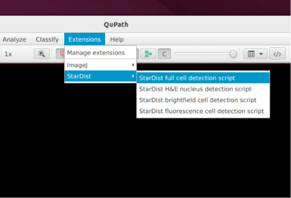
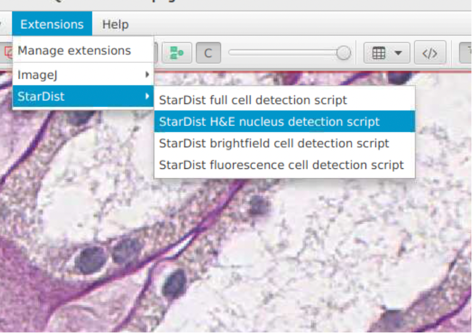
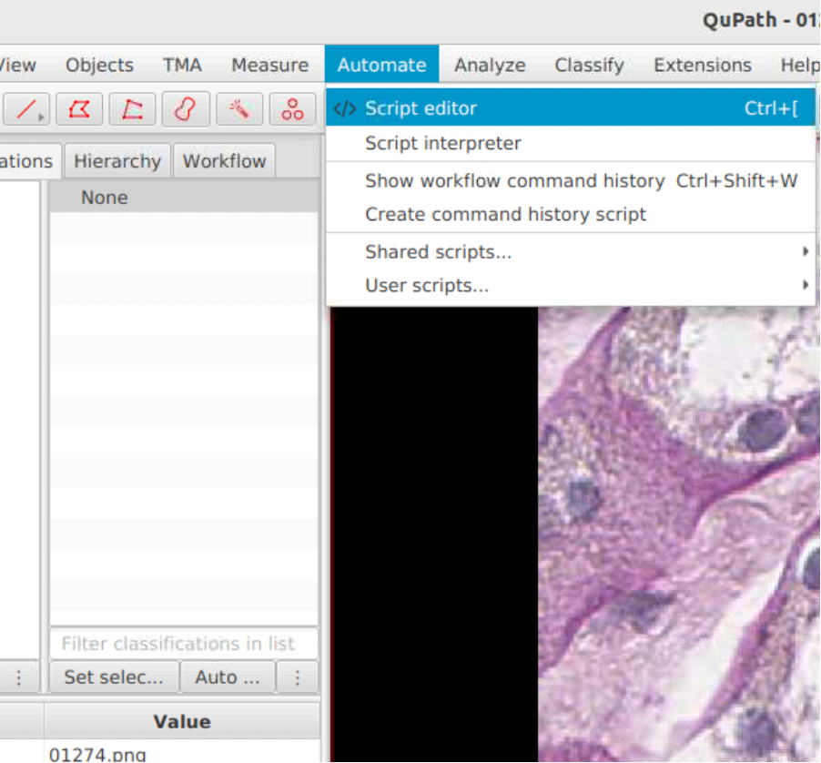
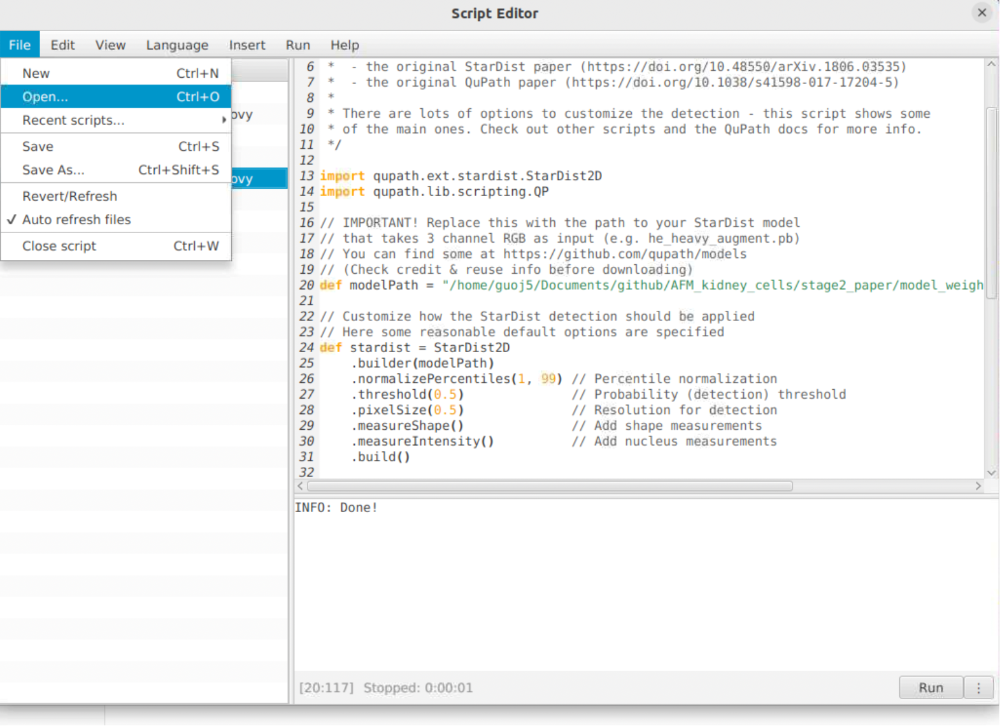
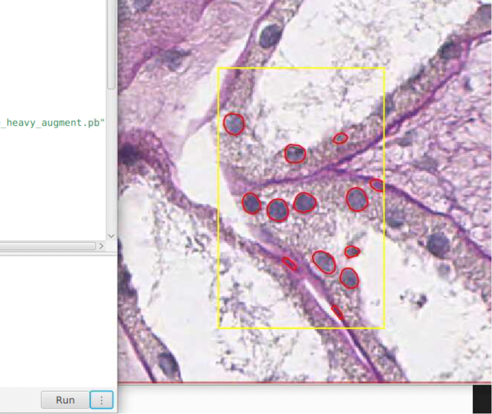
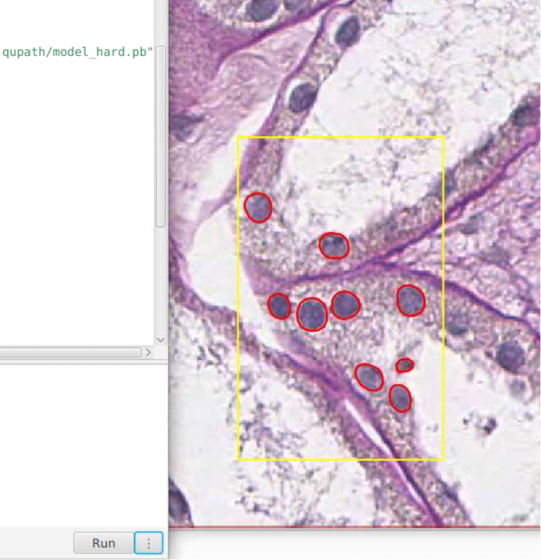

# StarDist Extension Setup for QuPath

This guide explains how to install the **StarDist extension** in **QuPath**, load a pretrained model, and run nucleus detection on whole-slide images or smaller patches.


## 1. Install QuPath
Download and install **QuPath v0.5.0** (the version I used):  
https://qupath.github.io


## 2. Install the StarDist Extension

1. For QuPath v0.5.0, the [qupath-extension-stardist-0.5.0.jar](./qupath-extension-stardist-0.5.0.jar) has already been downloaded.

   For other versions:
   - Visit the StarDist extension [releases page](https://github.com/qupath/qupath-extension-stardist/releases) and download the appropriate `.jar` file  

2. Drag the `.jar` file into QuPath.  

3. Verify the installation within QuPath via **Extensions** (there is **StarDist**)

<p align="center">
  
</p>

---

## 3. StarDist Model (.pb)


For H&E nuclei segmentation, we evaluate the StarDist baseline model [he_heavy_augment.pb](./he_heavy_augment.pb) (already downloaded)

For references, all official models are here:  
https://github.com/qupath/models/tree/main/stardist

---

## 4. Prepare Your Image
Drag a **WSI** or **image patch** into QuPath.

---

## 5. Run StarDist Nucleus Detection in QuPath

### 5.1 Load the detection script

**Option A:** Navigate via the UI.

<p align="center">
  
</p>

This is identical to [`qupath-stardist-detect.groovy`](./qupath-stardist-detect.groovy).

**Option B:** Open the Script Editor manually.

<p align="center">
  
</p>

Then open [`qupath-stardist-detect.groovy`](./qupath-stardist-detect.groovy).

<p align="center">
  
</p>
   
### 5.2 Configure the script

Set the model path, e.g. using the baseline model:

```groovy
def modelPath = '/path/to/he_heavy_augment.pb'
```

### 5.3 Run the detection

Draw a rectangular region on the image in QuPath and run the script.

<p align="center">
  
</p>
  

## 6. Use our trained models

We provide our finetuned QuPath StarDist models [here](../stage2_paper/model_weights/stardist-qupath/) from three training strategies. 

E.g., use `model_hard.pb` (model fine-tuned with Hard patches)
```groovy 
def modelPath = '/path/to/model_weights/stardist-qupath/model_hard.pb'
```
 <p align="center">
  
</p>

## 7. Flexible Detection-Annotations groovy script

The original groovy script (identical to [qupath-stardist-detect.groovy](./qupath-stardist-detect.groovy)) will generate **QuPath Detections**

[qupath-stardist-detect-annotate.groovy](./qupath-stardist-detect-annotate.groovy) outputs **QuPath annotations**, making manual corrections easier.

## 6. Documentation
More details and parameter descriptions:  
https://qupath.readthedocs.io/en/0.5/docs/deep/stardist.html


## Citation

If you find this repository useful, please consider giving a ⭐ and citing our papers:

```bibtex
@inproceedings{guo2025assessment,
  title={Assessment of cell nuclei AI foundation models in kidney pathology},
  author={Guo, Junlin and Lu, Siqi and Cui, Can and Deng, Ruining and Yao, Tianyuan and Tao, Zhewen and Lin, Yizhe and Lionts, Marilyn and Liu, Quan and Xiong, Juming and others},
  booktitle={Medical Imaging 2025: Image Perception, Observer Performance, and Technology Assessment},
  volume={13409},
  pages={76--82},
  year={2025},
  organization={SPIE}
}


@article{guo2025evaluating,
  title={Evaluating cell AI foundation models in kidney pathology with human-in-the-loop enrichment},
  author={Guo, Junlin and Lu, Siqi and Cui, Can and Deng, Ruining and Yao, Tianyuan and Tao, Zhewen and Lin, Yizhe and Lionts, Marilyn and Liu, Quan and Xiong, Juming and others},
  journal={Communications Medicine},
  volume={5},
  number={1},
  pages={495},
  year={2025},
  publisher={Nature Publishing Group}
}


@article{wang2025evaluating,
  title={Evaluating New AI Cell Foundation Models on Challenging Kidney Pathology Cases Unaddressed by Previous Foundation Models},
  author={Wang, Runchen and Guo, Junlin and Lu, Siqi and Deng, Ruining and Lu, Zhengyi and Zhu, Yanfan and Yang, Yuechen and Qu, Chongyu and Wang, Yu and Zhao, Shilin and others},
  journal={arXiv preprint arXiv:2510.01287},
  year={2025}
}
```