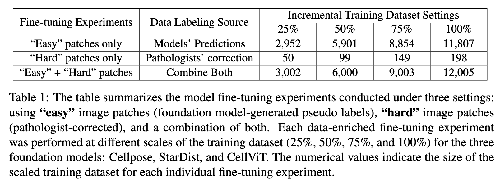

# Evaluating Cell AI Foundadtion Models (FMs) in Kidney Pathology with Human-in-the-Loop Enrichment

**TL;DR**: 

- Using multiple cell FMs to scalably enrich annotations and for continuous model improvement.

- Benchmarking performance evaluation (**stage 1**) and fine-tuning (**stage 2**) on Cellpose 2.0, StarDist (Histo.), and CellViT in kidney pathology. 

- Can be adapted for Newer models (**stage 3**).

## Overview 

- Stage-1 Performance Assessment: [**Assessment of Cell Nuclei AI Foundation Models in Kidney Pathology**](https://arxiv.org/abs/2408.06381)
- Stage-2 A CellFM-HITL Framework for Assessment (Stage-1) and Efficient Enhancement: [**Evaluating Cell AI Foundation Models in Kidney Pathology with Human-in-the-Loop Enrichment**](https://arxiv.org/abs/2411.00078)

## CellFM-HITL Workflow 

1. Construct Large-scale, Diverse dataset for Evaluation.

  

2. Less model bias and more generalizability — performing multiple cell FMs Inference and segmentaiton ratings.

  

3. How can we efficiently improve FMs for Kidney ? Our CellFM-HITL Data Enrichment.

<!-- 

  

 -->

  

## Implementations

### 1. Individual Cell FMs Inference and Ratings

| Year–Month | Model | Backbone | Post-processing  | Inference code|
|:---:|:---:|:---:|:---:|:---:|
| 2022 Mar | StarDist (Histo.) | U-Net | Star-convex Polygon |[StarDist Inference](../stage1_paper/stardist-inference-gpu/README.md)|
| 2022 Nov | Cellpose 2.0 | U-Net |GradientFlow Tracking |[Cellpose 2.0 Inference](../stage1_paper/cellpose-inference-gpu/README.md) |
| 2023 Oct | CellViT  | ViT (HIPT, SAM) |HoVer-Net |[CellViT Inference](../stage1_paper/cellvit-inference-gpu/README.md)|

- Since Stage 2 focused on validating the CellFM-HITL framework, the FMs evaluated were released before August 2024.

- We also have the new cell FMs (**Cellpose-SAM, CellViT++ variants released 2024 Aug. - 2025 Aug.**) assessment, in [**stage3_paper folder**](../stage3_paper/).

### 2. Data/Annotations Enrichment with FMs 

- We combined **"Easy"** (FMs-generated-pedictions) with **"Hard"** image patches (all models failed and pathologists corrected) for model refinement. 

- Python script for converting prediction to geojson (in **QuPath**) is provided, [**mask_to_geojson_qupath.py**](../mask_to_geojson_qupath.py).

### 3. Continously Finetuned with Enriched data 

- This work have experimented the finetuned model performance on following annotation enrichment settings. 

- We also experimented each annotation enrichment strategy with different dataset scales (25%, 50% ... 100%)

  

