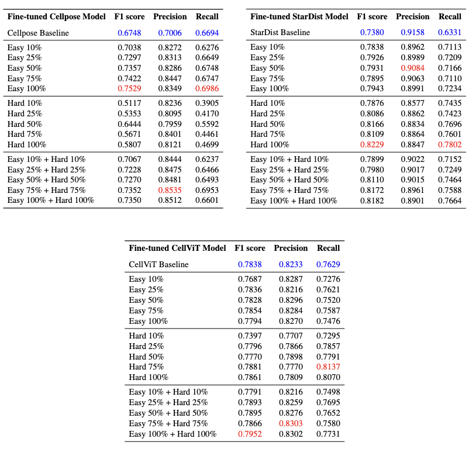

# Evaluating Cell AI Foundadtion Models (FMs) in Kidney Pathology with Human-in-the-Loop Enrichment

<!-- ## Overview  -->

<!-- - Stage-1 Performance Assessment: [**Assessment of Cell Nuclei AI Foundation Models in Kidney Pathology**](https://arxiv.org/abs/2408.06381)
- Stage-2 A CellFM-HITL Framework for Assessment (Stage-1) and Efficient Enhancement: [**Evaluating Cell AI Foundation Models in Kidney Pathology with Human-in-the-Loop Enrichment**](https://arxiv.org/abs/2411.00078) -->


## CellFM-HITL Workflow 

1. Construct Large-scale, Diverse dataset for Evaluation.

<p align="center">
  
</p>


2. Less model bias and more generalizability — performing multiple cell FMs Inference and segmentaiton ratings.

<p align="center">
  
</p>


3. How can we efficiently improve FMs for Kidney ? Our CellFM-HITL Data Enrichment.

<!-- <p align="center">
  
</p> -->


<p align="center">
  
</p>

This work have experimented the following **annotation enrichment strategies** for model finetuning. 

  - **Easy patches**: Foundation model-generated pseudo labels.
  - **Hard patches**: Pathologist-corrected shared failure cases
  - **Combined set**: Combination of easy and hard patches for balanced refinement.


## Results 

<p align="left">
  <a href='https://arxiv.org/abs/2411.00078'></a> 
</p>

### Model Performances 

<p align="center">
  
</p>

### Data Enrichment for Finetuning 

- We also experimented each annotation enrichment strategy with different dataset scales (25%, 50% ... 100%)

<p align="center">
  
</p>

### Performance after Finetuning 

- Baselines: We evaluated each foundation model’s (Cellpose, StarDist, CellViT) pre-trained weights on our hold-out test set.

- F1-score (and full metrics) comparisons across training/annotation strategies are shown (below).

<br>

<p align="center">
  
</p>

<br>

<p align="center">
  
</p>


- Qualitative results. Areas of improvement highlighted by rectangles.

<p align="center">
  
</p>

#### Observation 

- **Baseline performance evaluation**, CellViT achieves the highest F1 score of 0.78. Kidney-targeted FMs still required.
- **Fine-tuning with enriched data** improves all three models, with StarDist achieving the highest F1 score of 0.82. 
- **Annotation Enrichment**: We found the **combination** of the <ins>foundation model–generated pseudo-labels</ins> and <ins>a subset of pathologist-corrected hard patches</ins> yields consistent performance gains across all models.


 ### This CellFM-HITL Assessment and Enhancement Framework can be Iterative.

<p align="left">
  <a href='https://arxiv.org/abs/2510.01287'></a> 
</p>

- In our Stage 3 work, with newer Cell AI FMs (2025) such as CellViT++[Virchow] and Cellpose-SAM, a portion of the **previously rated “medium” or challenging patches** are now correctly labeled by these newer models (rated as “Good”). 

<br>

<p align="center">
  
</p>

## Implementations and Codes

### 1. Individual Cell FMs Inference and Ratings

  Model | Original Baseline Inference code|
  |:---:|:---:|
  | StarDist (Histo.) | [StarDist Inference](../stage1_paper/stardist-inference-gpu/README.md)|
  | Cellpose  | [Cellpose 2.0 Inference](../stage1_paper/cellpose-inference-gpu/README.md) |
  | CellViT  | [CellViT Inference](../stage1_paper/cellvit-inference-gpu/README.md)|

- We also have the new cell FMs (**Cellpose-SAM, CellViT++ variants released 2024 Aug. - 2025 Aug.**) assessment, in [**stage3_paper folder**](../stage3_paper/).

### 2. Annotate/Curate Data in QuPath 

- Script for converting prediction to geojson (for correction in **QuPath**): [**mask_to_geojson_qupath.py**](../mask_to_geojson_qupath.py).

### 3. Finetuned with Enriched Data 

  Finetuned Models | data processing| Weights from Strategies | Implementations|
  |:---:|:---:|:---:|:---:|
  | StarDist (Histo.) |  RGB | [Easy, Hard, Combined](./model_weights/stardist/)|[stardist_tuned](./stardist_tuned/README.md) |
  |Cellpose Finetuned| DAPI-like | [Easy](./model_weights/cellpose/Easy_100%/) | [cellpose_tuned](./cellpose_tuned/README.md)
  | CellViT   |  RGB | | |

- Due to storage limits, the **best model weights** are listed above and saved in [model_weights](./model_weights/); all model weights are available on [Google Drive](https://drive.google.com/drive/folders/1ztkcIC63Kjwafq6tHuEnENSdZ8-H3gSz?usp=sharing).

## License

This script is provided under the MIT License. Please see the LICENSE file for details.

## Citation

If you find this repository useful, please consider giving a ⭐ and citing our papers:

```bibtex
@inproceedings{guo2025assessment,
  title={Assessment of cell nuclei AI foundation models in kidney pathology},
  author={Guo, Junlin and Lu, Siqi and Cui, Can and Deng, Ruining and Yao, Tianyuan and Tao, Zhewen and Lin, Yizhe and Lionts, Marilyn and Liu, Quan and Xiong, Juming and others},
  booktitle={Medical Imaging 2025: Image Perception, Observer Performance, and Technology Assessment},
  volume={13409},
  pages={76--82},
  year={2025},
  organization={SPIE}
}


@article{guo_evaluating_2025,
  author       = {Guo, Junlin and Lu, Siqi and Cui, Can and Deng, Ruining and Yao, Tianyuan and Tao, Zhewen and Lin, Yizhe and Lionts, Marilyn and Liu, Quan and Xiong, Juming and Wang, Yu and Zhao, Shilin and Chang, Catie and Wilkes, Mitchell and Fogo, Agnes and Yin, Mengmeng and Yang, Haichun and Huo, Yuankai},
  title        = {Evaluating cell AI foundation models in kidney pathology with human-in-the-loop enrichment},
  journal      = {Communications Medicine},
  volume       = {5},
  year         = {2025},
  number       = {1},
  pages        = {495},
  doi          = {10.1038/s43856-025-01205-x},
  url          = {https://doi.org/10.1038/s43856-025-01205-x},
  month        = nov
}


@article{wang2025evaluating,
  title={Evaluating New AI Cell Foundation Models on Challenging Kidney Pathology Cases Unaddressed by Previous Foundation Models},
  author={Wang, Runchen and Guo, Junlin and Lu, Siqi and Deng, Ruining and Lu, Zhengyi and Zhu, Yanfan and Yang, Yuechen and Qu, Chongyu and Wang, Yu and Zhao, Shilin and others},
  journal={arXiv preprint arXiv:2510.01287},
  year={2025}
}
```