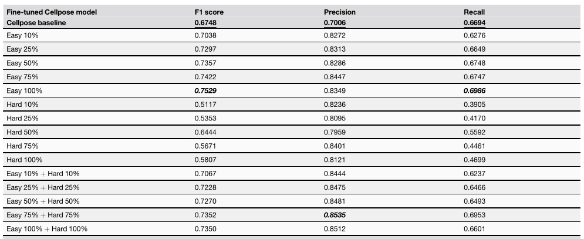

# Cellpose Fine-tuning and Models


## Installation 

1. Create conda env
```bash
conda create -n <env_name> python=3.9
conda activate <env_name> 
```
2. For easier API-based training, we use Cellpose **3.0**, which retains the same model weights as our baseline.
```bash
pip install cellpose==3.0
```
3. Install pytorch and necessary packages 

```bash
pip install torch torchvision --index-url https://download.pytorch.org/whl/cu113

pip install matplotlib pillow tqdm pyyaml
```

4. Numpy and Opencv (the following versions should work)
```bash 
pip install numpy==1.23.4 

pip install opencv-python-headless==4.8.1.78 
```

## DAPI-like data prep 

The first band contains the grayscale intensity and the second band is typically unused (set to zeros). This numpy ndarray format is compatible with Cellpose 3.0's training and inference APIs.

Update the `input_folder` and `output_folder` paths in [preprocess_image.py](preprocess_image.py)
```python
if __name__ == "__main__":

    # Paths
    input_folder = '/path/to/rgb/images/folder'             
    output_folder = '/path/to/images_processed/folder'    
    os.makedirs(output_folder, exist_ok=True)
    
    preprocess_image_bands(input_folder, output_folder)

```

then run:
```bash   
python preprocess_image.py
```
Example processed images and their paired labels are provided in [data_dummy](data_dummy). These labels are FM-generated (noted as "easy", or rated as "good" by human).  

```bash
data_dummy
├── train
│   ├── images_processed
│   │   ├── image1.npy
│   │   ├── image2.npy
│   └── labels
│       ├── image1.npy
│       ├── image2.npy
└── val
    ├── images_processed
    │   └── xxx.npy
    ├── labels
    │   └── xxx.npy
        ... 
```

## Model Weights and Inference


### Model Weights

In this work, Cellpose model fine-tuned with all "Easy" labels achieves the best performance. The corresponding model weight is provided in [Easy_100%](../model_weights/cellpose/Easy_100%25/) in `model_weights/cellpose` folder.


<p align="center">
  
</p>

### Model Inference

1. Prepare images in the 2-band ndarray format (see [DAPI-like data prep](#dapi-like-data-prep)).

2. Update paths in `run_model.py`:
   - `data_dir`: processed 2-band `.npy` images
   - `rgb_dir`: corresponding RGB `.png` images
   - `output_dir`: output directory
   - `model_path`: fine-tuned model path


3. Run inference on the processed images:
```bash
python run_model.py
```


### Evaluation (optional)

1. [StarDist](https://github.com/stardist/stardist) provides clean inference API for calculating nuclei instance segmentation metrics. To use it, first install `stardist` in your conda environment.
```bash
conda activate <env_name>
pip install stardist
```
2. Then run `evaluate.py` with the specified paths to the prediction and ground-truth label folders (`.npy` files).
```bash
python evaluate.py --predictions /path/to/model/predictions/folder --gt /path/to/labels/folder --log_csv /path/to/log/metrics.csv 
```

## Training Instructions 

1. Prepare training data in the 2-band ndarray format (see [DAPI-like data prep](#dapi-like-data-prep)).

2. Create a training configuration file (see [easy_25percent.yaml](train_configs/easy_25percent.yaml) for an example).

3. Run training, the `finetuned_model` file is saved at the `save_path` defined in the config file.
```bash
python train_model.py --config /path/to/config.yaml
```

In our work, we used these <ins>experimental training settings</ins>:

- **Dataset types:** We used "easy" (FM-generated) annotations, "hard" (pathologist-corrected) annotations, or a combined set (both types). For the combined set, we applied class-wise weighted oversampling (see [Supplementary Information 1](../supp_info.pdf)).

- **Configuration details:** See [Supplementary Information 2.2](../supp_info.pdf).


## Citation

If you find this repository useful, please consider giving a ⭐ and citing our papers:

```bibtex
@inproceedings{guo2025assessment,
  title={Assessment of cell nuclei AI foundation models in kidney pathology},
  author={Guo, Junlin and Lu, Siqi and Cui, Can and Deng, Ruining and Yao, Tianyuan and Tao, Zhewen and Lin, Yizhe and Lionts, Marilyn and Liu, Quan and Xiong, Juming and others},
  booktitle={Medical Imaging 2025: Image Perception, Observer Performance, and Technology Assessment},
  volume={13409},
  pages={76--82},
  year={2025},
  organization={SPIE}
}


@article{guo2025evaluating,
  title={Evaluating cell AI foundation models in kidney pathology with human-in-the-loop enrichment},
  author={Guo, Junlin and Lu, Siqi and Cui, Can and Deng, Ruining and Yao, Tianyuan and Tao, Zhewen and Lin, Yizhe and Lionts, Marilyn and Liu, Quan and Xiong, Juming and others},
  journal={Communications Medicine},
  volume={5},
  number={1},
  pages={495},
  year={2025},
  publisher={Nature Publishing Group}
}


@article{wang2025evaluating,
  title={Evaluating New AI Cell Foundation Models on Challenging Kidney Pathology Cases Unaddressed by Previous Foundation Models},
  author={Wang, Runchen and Guo, Junlin and Lu, Siqi and Deng, Ruining and Lu, Zhengyi and Zhu, Yanfan and Yang, Yuechen and Qu, Chongyu and Wang, Yu and Zhao, Shilin and others},
  journal={arXiv preprint arXiv:2510.01287},
  year={2025}
}
```