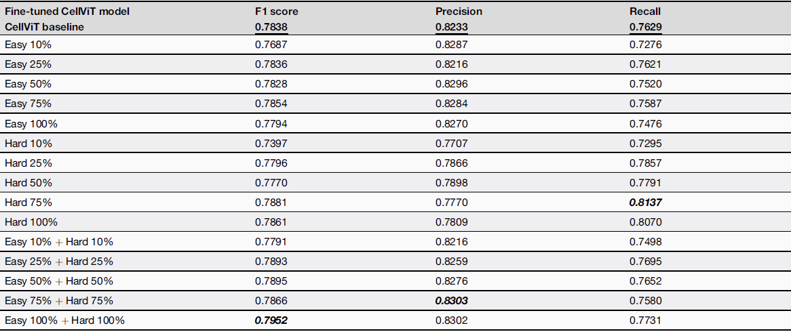

# CellViT Framework Fine-tuning and Models

## Installation 
<!-- The same conda environment used for training + inference as in [cellvit-inference-gpu](../../stage1_paper/cellvit-inference-gpu/README.md#installation). -->

### Option 1: Use Conda

```bash
conda env create -f environment.yml
conda activate <env_name>
```

### Option 2: Use Pip 

```bash
conda create -n <env_name> python=3.9.7
conda activate <env_name>

pip install -r requirements.txt
```
The [environment.yml](https://github.com/TIO-IKIM/CellViT/blob/main/environment.yml) and [requirements.txt](https://github.com/TIO-IKIM/CellViT/blob/main/requirements.txt) files are taken from the original CellViT [<ins>GitHub repo</ins>](https://github.com/TIO-IKIM/CellViT/tree/main) (link here). 


## Model Weights and Inference
Simply place image patches (512x512 PNG, 40x) into a dataset folder.

### Model Checkpoints 

The CellViT pre-trained checkpoint from CellViT paper can be found: 
- [CellViT-SAM-H](https://drive.google.com/uc?export=download&id=1MvRKNzDW2eHbQb5rAgTEp6s2zAXHixRV) 🚀
- [CellViT-256](https://drive.google.com/uc?export=download&id=1tVYAapUo1Xt8QgCN22Ne1urbbCZkah8q) (We used this HIPT-256 for Baseline evaluation)
- [CellViT-SAM-H-x20](https://drive.google.com/uc?export=download&id=1wP4WhHLNwyJv97AK42pWK8kPoWlrqi30)
- [CellViT-256-x20](https://drive.google.com/uc?export=download&id=1w99U4sxDQgOSuiHMyvS_NYBiz6ozolN2)

Finetuned Model Weights:

- The combined "Easy + Hard" annotations yields the best performance improvement for CellViT.

- Due to storage limites, the best model weight [Easy_Hard_100%]() and all model weights/checkpoints are available on [Google Drive](https://drive.google.com/drive/folders/1ztkcIC63Kjwafq6tHuEnENSdZ8-H3gSz?usp=sharing).

<p align="center">
  
</p>

### Model Inference 

```bash
python /path/to/CellViT-kidney/cell_segmentation/inference/inference_cellvit_experiment_kidney.py \
    --gpu 0 \
    --model /path/to/checkpoint.pth \
    --patching True \
    --overlap 0 \
    --dataset /path/to/dataset_folder \
    --outdir /path/to/output
```
This script works the same way as the `inference_cellvit_experiment_ca.py` in [stage1_paper](../../stage1_paper/cellvit-inference-gpu/README.md#run-the-inference-script).

### Evaluation (optional)


Run `evaluate.py` with the specified paths to the prediction and ground-truth label folders (`.npy` files).
```bash
python /path/to/CellViT-kidney/cell_segmentation/evaluate.py --predictions /path/to/model/predictions/folder --gt /path/to/labels/folder --log_csv /path/to/output_dir/metrics.csv 
```

## Training Instructions

[ ] to do: update readme

## Citation

If you find this repository useful, please consider giving a ⭐ and citing our papers:

```bibtex
@inproceedings{guo2025assessment,
  title={Assessment of cell nuclei AI foundation models in kidney pathology},
  author={Guo, Junlin and Lu, Siqi and Cui, Can and Deng, Ruining and Yao, Tianyuan and Tao, Zhewen and Lin, Yizhe and Lionts, Marilyn and Liu, Quan and Xiong, Juming and others},
  booktitle={Medical Imaging 2025: Image Perception, Observer Performance, and Technology Assessment},
  volume={13409},
  pages={76--82},
  year={2025},
  organization={SPIE}
}


@article{guo2025evaluating,
  title={Evaluating cell AI foundation models in kidney pathology with human-in-the-loop enrichment},
  author={Guo, Junlin and Lu, Siqi and Cui, Can and Deng, Ruining and Yao, Tianyuan and Tao, Zhewen and Lin, Yizhe and Lionts, Marilyn and Liu, Quan and Xiong, Juming and others},
  journal={Communications Medicine},
  volume={5},
  number={1},
  pages={495},
  year={2025},
  publisher={Nature Publishing Group}
}


@article{wang2025evaluating,
  title={Evaluating New AI Cell Foundation Models on Challenging Kidney Pathology Cases Unaddressed by Previous Foundation Models},
  author={Wang, Runchen and Guo, Junlin and Lu, Siqi and Deng, Ruining and Lu, Zhengyi and Zhu, Yanfan and Yang, Yuechen and Qu, Chongyu and Wang, Yu and Zhao, Shilin and others},
  journal={arXiv preprint arXiv:2510.01287},
  year={2025}
}
```