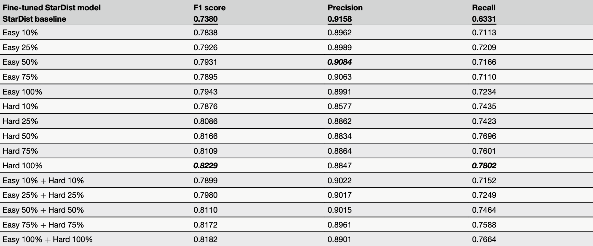

# StarDist (Histo.) Fine-tuning and Models

## Requirements

- Python 3.8 and TensorFlow 2.4.4 (the version we use)
- CUDA-compatible GPU (recommended) or CPU
- NVIDIA GPU drivers (for GPU support)

## Installation 

If already created the conda environment and installed packages for stardist inference following the [Step-by-Step Install instructions (option 1)](../../stage1_paper/stardist-inference-gpu/README.md#option-1-step-by-step-install), then only need to install `gputools` for training acceleration.
```bash
pip install gputools==0.2.14
```

## Model Weights and Inference

### Model Weights 

- Kidney-finetuned StarDist models show improved F1 and Recall across all three annotation strategies while maintaining Precision. 

- Due to storage limites, the **best model weights** for <ins>each strategy</ins> are provided in [(model_weights/stardist)](../model_weights/stardist/), and all model weights are available on [Google Drive](https://drive.google.com/drive/folders/1ztkcIC63Kjwafq6tHuEnENSdZ8-H3gSz?usp=sharing).


<p align="center">
  
</p>

### Finetuned Model Inference 

Run inference on images using a finetuned StarDist model with `run_model.py`. 

**Usage:**
```bash
python run_model.py \
    --model_dir /path/to/model/directory \
    --image_dir /path/to/input/images \
    --output_dir /path/to/output/directory
```

**Arguments:**
- `--model_dir`: Path to the finetuned model directory
- `--image_dir`: Path to directory containing input PNG images
- `--output_dir`: Path to output directory where results will be saved

### Example Run 
Use the finetuned model (trained with Easy 100%). 
```bash
python run_model.py \
    --model_dir /path/to/model_weights/stardist/Easy/Easy_100% \
    --image_dir /path/to/input/images \
    --output_dir /path/to/output/directory
```

### Use Models in QuPath 

- Since StarDist achieves the best performance after fine-tuning on our kidney data, we also provide guide on [*"How to installed and use our pretrained models in QuPath"*](../qupath_stardist/README.md) 

- Similarly, Representative fine-tuned Qupath models in [stardist-qupath](../model_weights/stardist-qupath/).  

## Training Instructions 

### Training Data 

Prepare `images` (.png files) and `labels` (.npy files) for both training and validation. Some examples are provided in `data_dummy`.

```bash
train_hard_100
├── images
│   ├── 00295.png
│   ├── ...
├── labels
│   ├── 00295.npy
│   ├── ...

val
├── images
│   ├── xxx.png
│   ├── ...
├── labels
│   ├── xxx.npy
│   ├── ...
```
### Training 

Specifically, assign paths to "train, val folders, and output model" before running [train_model.ipynb](./train_model.ipynb)

```python
train_image_dir = '/path/to/images' # folder of png files
train_mask_dir = 'path/to/labels'   # folder of npy lables 

val_image_dir = '/path/to/val/images' # folder of png files
val_mask_dir = 'path/to/val/labels'   # folder of npy lables 

model_name = '/path/to/saved/model/folder' # the finetuned model saved here 
```

To run inference with the trained model, use the path specified in `model_name` as the `--model_dir` argument in the inference command above. See the ["Finetuned Model Inference"](#finetuned-model-inference) section for details. 

### Prepare QuPath model (optional)

- To convert Onnx, see `tf2onnx.ipynb`. The output `.pb` file can be used in QuPath. (we followed QuPath official implementation, [here](https://github.com/qupath/models/tree/main/stardist#conversion))


- For Usage, see [Use Models in QuPath](#use-models-in-qupath) for details.  

## Citation

If you find this repository useful, please consider giving a ⭐ and citing our papers:

```bibtex
@inproceedings{guo2025assessment,
  title={Assessment of cell nuclei AI foundation models in kidney pathology},
  author={Guo, Junlin and Lu, Siqi and Cui, Can and Deng, Ruining and Yao, Tianyuan and Tao, Zhewen and Lin, Yizhe and Lionts, Marilyn and Liu, Quan and Xiong, Juming and others},
  booktitle={Medical Imaging 2025: Image Perception, Observer Performance, and Technology Assessment},
  volume={13409},
  pages={76--82},
  year={2025},
  organization={SPIE}
}


@article{guo2025evaluating,
  title={Evaluating cell AI foundation models in kidney pathology with human-in-the-loop enrichment},
  author={Guo, Junlin and Lu, Siqi and Cui, Can and Deng, Ruining and Yao, Tianyuan and Tao, Zhewen and Lin, Yizhe and Lionts, Marilyn and Liu, Quan and Xiong, Juming and others},
  journal={Communications Medicine},
  volume={5},
  number={1},
  pages={495},
  year={2025},
  publisher={Nature Publishing Group}
}


@article{wang2025evaluating,
  title={Evaluating New AI Cell Foundation Models on Challenging Kidney Pathology Cases Unaddressed by Previous Foundation Models},
  author={Wang, Runchen and Guo, Junlin and Lu, Siqi and Deng, Ruining and Lu, Zhengyi and Zhu, Yanfan and Yang, Yuechen and Qu, Chongyu and Wang, Yu and Zhao, Shilin and others},
  journal={arXiv preprint arXiv:2510.01287},
  year={2025}
}
```